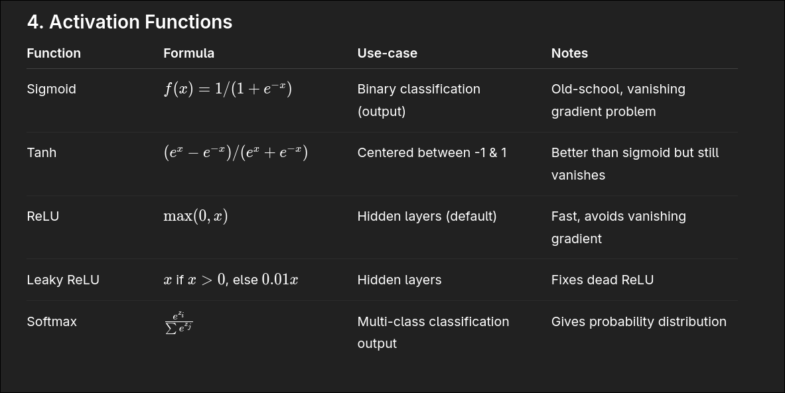

🧠 Artificial Neural Networks (ANN) – Notes

---

1. What is ANN?

Artificial Neural Network (ANN) → Inspired by human brain neurons.

Consists of layers of interconnected neurons.

Each neuron does:

z = \sum (w_i a_i) + b

a = \text{activation}(z) 

---

2. Structure of ANN

1. Input Layer – takes raw data (pixels, features).

2. Hidden Layers – apply transformations (weights + bias + activation).

3. Output Layer – gives final prediction (class, probability, etc.).

---

3. Important Components

Weights (w): Importance of each input.

Bias (b): Shifts the activation threshold.

Activation Function (f): Introduces non-linearity.

---

4. Activation Functions

---

5. Training Process

1. Forward Propagation – compute outputs using weights & bias.

2. Loss Function – measure error vs ground truth.

Binary classification → Binary Cross-Entropy.

Multi-class classification → Categorical Cross-Entropy.

Regression → Mean Squared Error (MSE).

3. Backpropagation – compute gradients of loss wrt weights.

4. Optimizer (e.g., Gradient Descent, Adam) – update weights.

---

6. Problems & Solutions

Vanishing Gradient (sigmoid/tanh) → use ReLU.

Overfitting → use Dropout, Regularization (L1/L2), More Data.

Slow Training → use Batch Normalization, Good Initializations.

---

7. Variants of Neural Networks

ANN (Basic Neural Network): Works on tabular/simple data.

CNN (Convolutional Neural Network): Image & video processing.

RNN (Recurrent Neural Network): Sequential data (text, time-series).

LSTM/GRU: Advanced RNNs → better for long sequences.

GAN (Generative Adversarial Network): Image generation, deepfakes.

Transformer: Modern NLP & vision tasks (GPT, BERT, etc.).

---

8. Important Modern Points

ReLU replaced Sigmoid in hidden layers.

Softmax = standard for classification outputs.

Training requires lots of data + GPUs/TPUs.

ANN → base of Deep Learning (DL).

Deep Learning = ANN with many hidden layers.

🔹 Simple Example (1 Neuron) – Python
import numpy as np

# Inputs (jaise 3 features)
inputs = np.array([1.0, 2.0, 3.0])

# Weights (lines ke strength)
weights = np.array([0.2, 0.8, -0.5])

# Bias (threshold shift)
bias = 2.0

# Neuron ka output (dot product + bias)
output = np.dot(inputs, weights) + bias

print("Neuron Output:", output)

Multi-Neuron Layer (3 neurons in one layer)

import numpy as np

# Input vector
inputs = np.array([1.0, 2.0, 3.0, 2.5])

# Weights for 3 neurons (matrix form)
weights = np.array([
    [0.2, 0.8, -0.5, 1.0],   # Neuron 1
    [0.5, -0.91, 0.26, -0.5], # Neuron 2
    [-0.26, -0.27, 0.17, 0.87] # Neuron 3
])

# Biases for 3 neurons
biases = np.array([2.0, 3.0, 0.5])

# Output of the layer
output = np.dot(weights, inputs) + biases

print("Layer Output:", output)
