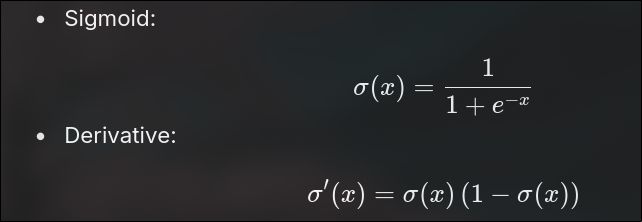
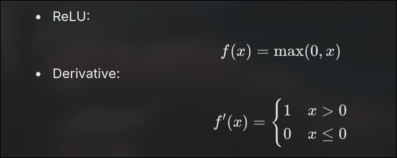
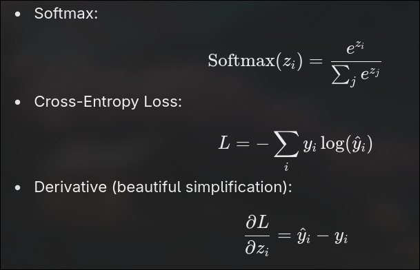
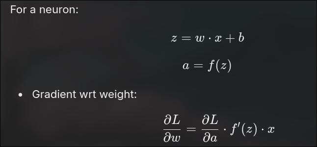
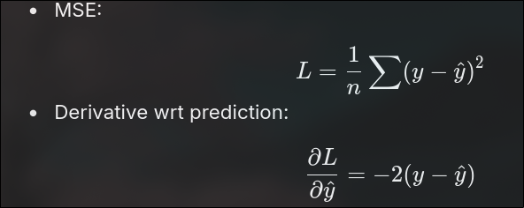
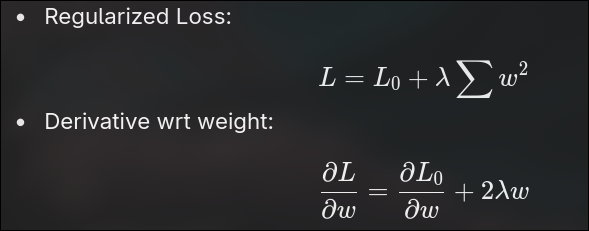
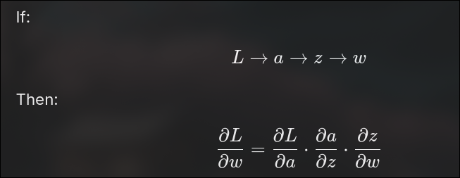

5. Problems & Fixes

Overfitting → Dropout, Regularization (l2), Early Stopping.

Vanishing gradient (sigmoid/tanh) → use ReLU.

Slow convergence → Batch Normalization, better optimizer.

🔥 Deep Learning Interview Q&A (2025, Easy Version)
1. Why do we use ReLU instead of Sigmoid in hidden layers?

Answer:

Sigmoid and Tanh make gradients (learning signal) very small → training becomes slow or stuck.

ReLU is simple (just max(0, x)), learns faster, and avoids this issue.

New versions like Leaky ReLU, GELU, Swish work even better in deep networks.

2. What is the role of bias in a neuron?

Answer:

Bias is like a free extra value added to the neuron.

It shifts the curve left or right so the model can learn patterns that don’t pass through zero.

Without bias, the neuron is less flexible and learns fewer things.

3. Difference between ANN, CNN, and RNN (with uses)?

Answer:

ANN: Normal networks for simple data (tables, numbers, classification).

CNN: Special for images and videos (vision, face recognition, object detection).

RNN: Good for data in order (text, speech, time-series).

Today: LSTM, GRU, and Transformers are used instead of plain RNN.

4. What is Softmax used for?

Answer:

Turns raw outputs into probabilities.

Every output becomes between 0–1, and total adds to 1.

Used for multi-class problems (like cat/dog/horse).

5. How do we stop Overfitting?

Answer:

Dropout: Randomly turn off some neurons while training → avoids memorization.

Regularization (L2): Stops weights from growing too big.

Early Stopping: Stop training when test accuracy no longer improves.

6. How do we solve Vanishing Gradient?

Answer:

Use ReLU instead of Sigmoid/Tanh.

Use Batch Normalization to keep values stable.

Use skip connections like in ResNet (helps signals pass easily).

7. What causes Slow Convergence, and how to fix it?

Answer:

Bad weight starting values, wrong scaling of input, or simple optimizers.

Fixes:

Batch Normalization (speeds training).

Better optimizers (Adam, RMSprop).

Learning rate scheduling (changing speed of learning during training).

8. Modern activation functions beyond ReLU?

Answer:

Leaky ReLU: Allows small negative values (avoids dead neurons).

GELU: Smooth, works great in Transformers.

Swish: Used in EfficientNet, gives better accuracy.

9. Why are GPUs/TPUs important for Deep Learning?

Answer:

Training needs huge matrix multiplications.

GPUs/TPUs do parallel work → 10x–100x faster than CPUs.

Without them, big models like GPT or BERT can’t be trained.

10. Are Transformers just another neural network?

Answer:

Yes ✅ They are still made of neurons, weights, and activations.

But instead of convolutions (CNN) or loops (RNN), they use self-attention to connect words or parts of data.

GPT, BERT, LLaMA are all Transformer-based networks.

✨ Extra Quick Questions (easy one-liners):

Q: Why use Batch Normalization?
A: To keep inputs stable and make training faster.

Q: What is Dropout?
A: Randomly switches off neurons during training → stops overfitting.

Q: Where do we still use Sigmoid?
A: For binary classification outputs (yes/no, spam/not spam).

📘 Important Derivations in Deep Learning (Interview Focus)
1. Gradient of Sigmoid

👉 Important because it shows why gradients become small (vanishing gradient problem).

2. Gradient of ReLU

👉 Explains why ReLU avoids vanishing gradients but can have dead neurons.

3. Gradient of Softmax + Cross-Entropy Loss

👉 Super important (used in almost every classification NN).

4. Backpropagation Rule

👉 Key formula → how weights get updated in training.

5. Gradient of Mean Squared Error (MSE) Loss

👉 Common in regression problems.

6. L2 Regularization

👉 Important to explain how regularization keeps weights small.

7. Chain Rule (Core of Backpropagation)

👉 Must understand, even if not fully derived in interview.

✅ Most Important for Interviews (Top 3)

Sigmoid derivative

ReLU derivative

Softmax + Cross-Entropy derivative → (ŷ - y)