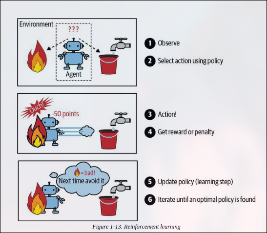

🚀 Why Use Machine Learning? (ML) 🤖
🧑💻 Traditional Programming:

    ✍️ Write rules manually (e.g., spam filter with “4U”, “credit card”, etc.)

    🔄 Rules get complex & hard to maintain

    🔧 Frequent updates needed as spammers change tricks

🤖 Machine Learning Approach:

    🧠 Learns patterns from data automatically — no hard coding needed

    🔄 Adapts quickly to new trends (e.g., “For U” = spam)

    ✨ Easier to maintain, usually more accurate

    🧩 Handles complex problems (like speech recognition)

    🔍 Helps discover hidden insights (data mining)

🌟 ML is Best For:

    📜 Problems with too many rules or frequent tweaks

    ❓ Problems with no clear algorithm

    🔄 Changing data/environments

    📊 Insights from big/complex datasets

🖼️ CNN (Convolutional Neural Network)

    🎯 Great at processing images

    🔍 Finds patterns by scanning small parts (edges, shapes)

    🏷️ Used for image recognition, face detection, object classification

🔄 RNN (Recurrent Neural Network)

    🔄 Excels in sequential data (time or language)

    🧠 Remembers what happened before (context)

    🎙️ Used for speech recognition, language translation, predictions

    Remember:

        🖼️ CNN = Images & patterns

        🔄 RNN = Sequences & order

| 📌 **Task**                      | 🧠 **ML Type**                | 🛠️ **Techniques Used**                             |
| -------------------------------- | ----------------------------- | --------------------------------------------------- |
| 📷 Classify product images       | Image Classification          | CNNs, Vision Transformers                           |
| 🧠 Detect tumors in scans        | Semantic Segmentation         | CNNs, Transformers                                  |
| 📰 Classify news articles        | NLP (Text Classification)     | RNNs, Transformers                                  |
| 🚫 Flag offensive comments       | NLP (Toxic Content Detection) | Transformers                                        |
| 📚 Summarize documents           | NLP (Summarization)           | Transformers                                        |
| 🤖 Build Chatbots                | NLP + QA (Conversational AI)  | Transformers, Natural Language Understanding (NLU)  |
| 📈 Predict revenue               | Regression                    | Linear Regression, SVM, Random Forests, Neural Nets |
| 🗣️ Voice command recognition    | Speech Recognition            | RNNs, Transformers                                  |
| 💳 Detect fraud transactions     | Anomaly Detection             | Isolation Forests, Autoencoders                     |
| 👥 Group similar customers       | Clustering                    | K-Means, DBSCAN                                     |
| 📊 Visualize complex data        | Dimensionality Reduction      | PCA, t-SNE                                          |
| 🛍️ Recommend products           | Recommender Systems           | Neural Networks, Collaborative Filtering            |
| 🎮 Train intelligent game agents | Reinforcement Learning (RL)   | Q-Learning, Deep Q-Networks, AlphaGo                |

    🔍 a) Training way: Supervised, Unsupervised, Semi-supervised, Self-supervised, others

    ↗️ b) Learning: Online (incremental) vs. Batch (all data at once)

    🔄 c) Generalization: Comparing new data vs. old or patterns in training data

A) ✅ SUPERVISED LEARNING

    📋 Data includes labels (desired output).

    🧠 Algorithm learns from input-output pairs.

B) ❓ UNSUPERVISED LEARNING

    📂 Training data is unlabeled.

    👓 Used in visualization, clustering.

C) 🌗 SEMI-SUPERVISED LEARNING

    🕵️♂️ Works with partially labeled data.

D) 🔄 SELF-SUPERVISED LEARNING

    🧩 Creates labeled data from unlabeled data for supervised learning.

E) 🎯 REINFORCEMENT LEARNING

---> rewarded when it get true value and punish when they done mistake !! 

    🎲 Learns by interacting with environment and rewards.

    🏆 Improves strategy over time.

 F) 📦 BATCH LEARNING

    🛑 No incremental learning; trains on entire data.

    ⏳ Prone to model rot (decay) as data changes.

G) ⚡ ONLINE LEARNING

    🌊 Learns continuously as new data arrives.

    🎯 Useful for fast-changing data (stock market, spam).

Learning Rate:

    🔥 High: fast learning, forgets old info

    ❄️ Low: slow learning, remembers more

Risk: 🔥 Bad data can hurt performance, so monitor carefully!
⚖️ ML Generalization: Instance-Based vs Model-Based
Instance-Based

    🧠 Learns by remembering examples.

    🔍 Uses similarity for prediction (e.g., KNN).

Model-Based

    🧮 Builds a mathematical model for predictions.

    🔄 Workflow: Collect data → Choose model → Train → Predict

    Example Linear Regression:
    \text{life_satisfactionn} = \theta_0 + \theta_1 \times \text{GDP\_per\_capita}

📊 Logistic Regression

    🎯 Supervised classification algorithm.

    🔢 Predicts class probability using sigmoid function.

    Formula:
    z=∑i=1nwixi+b
    z=i=1∑nwixi+b

    xixi = features, wiwi = weights, bb = bias.

🔑 Important Terms

    👤 Instance: One data example with features & label.

    🏷️ Feature: One input attribute of an instance.

    🎯 Label: The output target.

    ⚖️ Bias Term: Model intercept to shift predictions.

    🏷️ Labels: Targets in supervised learning.

    🧩 Clustering: Groups data by similarity (unsupervised).

🎯 Key Points for Interview

    🤖 ML automates learning and adapts automatically.

    ⚔️ Works where rule-based methods fail or don’t scale.

    🔄 Workflow: Data → Model → Train → Predict.

    ⚡ Online learning & learning rate are crucial.

    🧠 Instance-based = remember examples; model-based = predictive formulas.

✨ Good luck, brother! Rock that interview! 💪🚀 ✨

